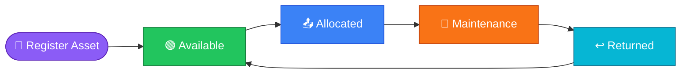
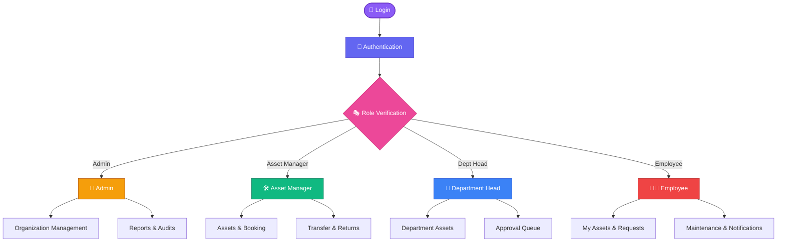
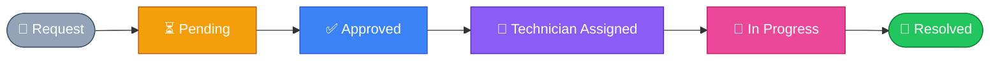

<div align="center">


# SyncFlow

### Enterprise Asset & Resource Management Platform

**Track. Allocate. Maintain. Audit. All in one place.**

<br/>

[](#)
[](#)
[](#)
[](#)
[](#)
[](#)

<br/>

[](https://github.com/tharaa1315-cmyk/odoo_hackathon_YTsquad)
[](#)
[](#)
[](#)

</div>

<br/>

<div align="center">

### `📖` [Overview](#-overview) &nbsp;•&nbsp; `✨` [Features](#-key-features) &nbsp;•&nbsp; `🧩` [Modules](#-modules) &nbsp;•&nbsp; `🖥` [Tech Stack](#-tech-stack) &nbsp;•&nbsp; `🚀` [Installation](#-installation) &nbsp;•&nbsp; `👥` [Team](#-team)

</div>

<br/>

---

## 📖 Overview

> SyncFlow is a modern **Enterprise Asset & Resource Management System** built for the **Odoo Hackathon 2026** — replacing spreadsheets and paper logs with a secure, scalable, role-based ERP platform.

<table>
<tr>
<td width="50%" valign="top">

**The problem**
Organizations juggle assets, bookings, and maintenance across disconnected spreadsheets — leading to lost equipment, double bookings, and zero audit trail.

</td>
<td width="50%" valign="top">

**The solution**
One centralized platform for asset registration, allocation, resource booking, maintenance workflows, audits, and analytics — with role-based access built in.

</td>
</tr>
</table>

<br/>

## ✨ Key Features

<table>
<tr>
<td align="center" width="25%">

### 🔐
**JWT Auth**
Secure login, registration & session management

</td>
<td align="center" width="25%">

### 🧑‍🤝‍🧑
**RBAC**
Fine-grained, role-based authorization

</td>
<td align="center" width="25%">

### 📦
**Asset Lifecycle**
Full tracking from registration to retirement

</td>
<td align="center" width="25%">

### 📊
**Live Analytics**
Dashboards & KPI reporting out of the box

</td>
</tr>
</table>

<br/>

### 👥 Role-Based Access

<div align="center">

| Role | Icon | Access Scope |
|:--|:--:|:--|
| **Admin** | 👑 | Complete organization management — full control |
| **Asset Manager** | 🛠 | Assets, allocation & maintenance oversight |
| **Department Head** | 🏢 | Department assets & approval workflows |
| **Employee** | 👨‍💼 | Personal assets & request submission |

</div>

<br/>

## 📦 Asset Lifecycle



<br/>

## 🔄 Complete Workflow



<br/>

## 🧩 Modules

<table>
<tr>
<td width="50%" valign="top">

### 🏢 Organization Setup
- Department configuration
- Asset categories
- Employee directory
- Role promotion

</td>
<td width="50%" valign="top">

### 💻 Asset Management
- Asset registration
- Allocation & transfer
- Return handling
- QR code generation
- Full asset history

</td>
</tr>
<tr>
<td width="50%" valign="top">

### 📅 Resource Booking
- Meeting rooms & conference halls
- Vehicle & equipment booking
- Calendar view
- Automatic conflict detection

</td>
<td width="50%" valign="top">

### 📊 Reports & Analytics
- Asset utilization
- Department & maintenance reports
- Resource usage insights
- Audit trail & dashboard KPIs

</td>
</tr>
</table>

<br/>

### 🔧 Maintenance Pipeline



<br/>

## 🖥 Tech Stack

<div align="center">

| Layer | Technology | Badge |
|:--|:--|:--|
| **Frontend** | React 19 + TypeScript + Vite |  |
| **Backend** | Node.js + Express.js |  |
| **Database** | MongoDB |  |
| **Auth** | JWT |  |
| **Styling** | Tailwind CSS |  |
| **Storage** | Cloudinary |  |
| **API** | REST |  |

</div>

<br/>

## 📂 Project Structure

```text
SyncFlow
│
├── 🎨 frontend
│   ├── src
│   ├── components
│   ├── pages
│   ├── layouts
│   └── services
│
├── ⚙️  backend
│   ├── config
│   ├── controllers
│   ├── middleware
│   ├── models
│   ├── routes
│   ├── utils
│   └── server.js
│
└── 📄 README.md
```

<br/>

## 🚀 Installation

<details open>
<summary><b>1️⃣ Clone the repository</b></summary>

```bash
git clone https://github.com/USERNAME/SyncFlow.git
```

</details>

<details open>
<summary><b>2️⃣ Backend setup</b></summary>

```bash
cd backend
npm install
cp .env.example .env
npm run seed
npm run dev
```

> Runs at **http://localhost:5000**

</details>

<details open>
<summary><b>3️⃣ Frontend setup</b></summary>

```bash
cd frontend
npm install
npm run dev
```

> Runs at **http://localhost:5173**

</details>

<br/>

### 🔑 Demo Account

<div align="center">

| Field | Value |
|:--|:--|
| 📧 Email | `admin@syncflow.app` |
| 🔒 Password | `Admin@123` |

*Available immediately after running the seed script.*

</div>

<br/>

## 🌟 Highlights

<div align="center">

✅ Enterprise ERP Architecture&nbsp;&nbsp;&nbsp;✅ Role-Based Access Control&nbsp;&nbsp;&nbsp;✅ JWT Authentication
✅ QR Code Asset Tracking&nbsp;&nbsp;&nbsp;✅ Maintenance Workflow&nbsp;&nbsp;&nbsp;✅ Resource Booking
✅ Audit Management&nbsp;&nbsp;&nbsp;✅ Dashboard Analytics&nbsp;&nbsp;&nbsp;✅ REST API&nbsp;&nbsp;&nbsp;✅ Scalable MERN Stack

</div>

<br/>

## 👥 Team

<div align="center">

### 🎖 Team Leader

**Tharanish B**

### 🧑‍🤝‍🧑 Team Members

| | | |
|:--:|:--:|:--:|
| Tamil Mutharasan D | Yogesh J | Yuvarajan M |

</div>

<br/>

## 🎯 Built For

<div align="center">

### 🏆 Odoo Hackathon 2026

> *Building the next generation Enterprise Asset & Resource Management Platform.*

</div>

---

<div align="center">

### ⭐ If you like this project, give it a Star ⭐

Made with ❤️ by **YT Squad**

</div>
